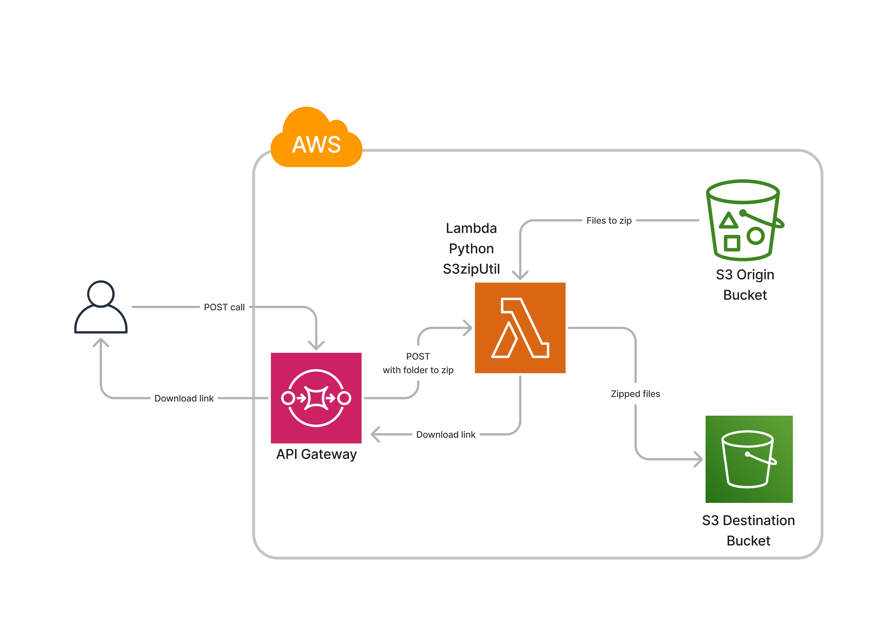

# S3 Zip Utility

## Visão Geral

Este projeto implementa uma solução serverless na AWS para compactar arquivos armazenados em um bucket S3 e gerar um link de download temporário. A compactação é realizada por uma função AWS Lambda, acionada por meio de um endpoint REST criado no API Gateway.

## Arquitetura



A solução utiliza os seguintes serviços da AWS:

- **S3**: Para armazenar os arquivos de origem e destino (compactados).
- **Lambda**: Para compactar os arquivos e gerar o link de download.
- **API Gateway**: Expondo um endpoint para a chamada da função Lambda.
- **IAM**: Gerencia as permissões da função Lambda.

## Pré-requisitos

Antes de usar este projeto, você deve:

- Ter uma conta AWS ativa.
- Criar dois buckets S3: um para os arquivos de origem e outro para armazenar os arquivos compactados.
- Configurar uma função Lambda com as permissões apropriadas para acessar o S3 (IAM Role).

## Configuração

1. **Buckets S3**:

   - Crie um bucket para armazenar os arquivos de origem.
   - Crie outro bucket para armazenar os arquivos compactados.

2. **API Gateway**:

   - Crie uma API no API Gateway.
   - Adicione o método POST que invoca a função Lambda.

3. **Lambda**:
   - Suba o script `lambda_function.py` para a função Lambda.
   - Certifique-se de que a função Lambda tenha permissões de leitura e escrita no S3.

## Permissões Mínimas Necessárias

Para que a função Lambda funcione corretamente e execute as operações no Amazon S3, as seguintes permissões devem ser concedidas ao IAM Role associado à função Lambda:

1. **Permissões para listar objetos no bucket de origem:**

   - `s3:ListBucket` em relação ao bucket de origem.

2. **Permissões para obter objetos do bucket de origem:**

   - `s3:GetObject` para permitir a leitura dos arquivos armazenados no bucket de origem.

3. **Permissões para criar e colocar objetos no bucket de destino:**

   - `s3:PutObject` para permitir que a função Lambda salve o arquivo zip no bucket de destino.

4. **Permissões para gerar URLs pré-assinadas:**
   - `s3:GeneratePresignedUrl` para permitir a criação de links temporários para download do arquivo zip.

### Exemplo de Política IAM

Aqui está um exemplo de política IAM que pode ser usada:

```json
{
  "Version": "2012-10-17",
  "Statement": [
    {
      "Effect": "Allow",
      "Action": ["s3:ListBucket"],
      "Resource": "arn:aws:s3:::BUCKET_ORIGEM"
    },
    {
      "Effect": "Allow",
      "Action": ["s3:GetObject"],
      "Resource": "arn:aws:s3:::BUCKET_ORIGEM/*"
    },
    {
      "Effect": "Allow",
      "Action": ["s3:PutObject"],
      "Resource": "arn:aws:s3:::BUCKET_DESTINO/*"
    }
  ]
}
```

Substitua `BUCKET_ORIGEM` e `BUCKET_DESTINO` pelos nomes reais dos seus buckets S3.

## Como Usar

Para compactar arquivos de uma pasta específica no S3, faça uma requisição POST para o endpoint exposto no API Gateway com o seguinte payload:

```json
{
  "bucket_origem": "nome-do-bucket-origem",
  "pasta_origem": "nome-da-pasta-origem",
  "bucket_destino": "nome-do-bucket-destino",
  "cnpj_ou_nome": "identificador"
}
```

### A resposta da API será:

```json
{
  "statusCode": 200,
  "body": {
    "message": "Arquivos compactados com sucesso!",
    "download_link": "url-temporaria-para-o-arquivo-zip"
  }
}
```
